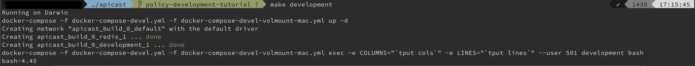
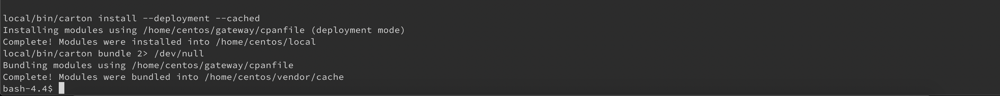
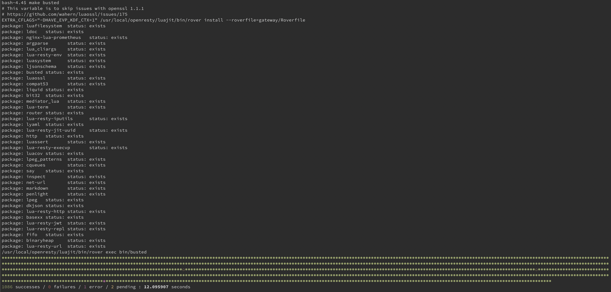

# Setting up the development environment

You need to configure an environment to work with Lua because APIcast policies are created in the Lua programming language. Additionally, you can use an actual APIcast server to perform local tests.

Following simple steps, you can set up a development environment for APIcast using Docker and Docker Compose.

### prerequisites
This means both Docker and Docker compose must be installed.

The version of Docker I currently use is:

   * Docker version 19.03.8. You can find instructions for installing Docker in the Docker [website](https://docs.docker.com/get-docker/).

Instructions for installing Docker can be found on the Docker [website](https://docs.docker.com/get-docker/).

With Docker compose version:

   * `docker-compose` version 1.25.4. You can find instructions for installing `docker-compose` in the Docker [website](https://docs.docker.com/compose/install/).

Instructions for installing Docker-compose can also be found on the Docker [website](https://docs.docker.com/compose/install/).

### Setting up the development image
After you have installed both Docker and `docker-compose`, you can configure the APIcast development image.

. Clone the APIcast git repository. Use the stable branch of APIcast to base the policy on the latest 3scale release. 

```shell
git clone https://github.com/3scale/apicast.git
```

. Switch to a stable branch. In this case, the example uses version `3.8`: 
```shell
cd apicast/
git checkout 3.8-stable
```

. To start the APIcast containers using `docker-compose`,  use the *make* file provided by 3scale. Run this command in the APIcast directory:
```shell
make development
```



. The Docker container starts in the foreground with a bash session. The next step is to install all the dependencies inside the container, using a *make* command:

This can also be done using a Make command, which again must be issued **inside** the container.
```shell
make dependencies
```
It will now download and install a plethora of dependencies inside the container.

+
* The output will be very long. After a successful completion of the installation of all the dependencies, you will see a message similar to this:
+



Now as a final verification we can run some APIcast unit tests to see if we are up and running and ready to start the development of our policy.

. To run the Lua unit tests use this command **inside** the container:

```shell
make busted
```


After confirming that the unit tests run successfully, you can start the policy development.

The project’s source code will be available in the container and sync’ed with your local apicast directory, so you can edit files in your preferred environment and still be able to run whatever you need inside the Docker container.

The development container for APIcast uses a Docker volume mount to mount the local apicast directory inside the container. This means all files changed locally in the repository are synced with the container and used in the tests and runtime of the development container.


It also means you can use your favorite IDE or editor develop your APIcast policy.

### Stopping the development container
Stopping the development environment container is a two step process. In the interactive Bash session simple press:

```
Ctrl + C
```

This exits the foreground bash shell, but the containers are still running. Execute the following make command to cleanly stop all containers:

```shell
$ make stop-development
docker-compose -f docker-compose-devel.yml -f docker-compose-devel-volmount-mac.yml down
Stopping apicast_build_0_development_1 ... done
Stopping apicast_build_0_redis_1       ... done
Removing apicast_build_0_development_1 ... done
Removing apicast_build_0_redis_1       ... done
Removing network apicast_build_0_default
```

Now we are ready to create a 3scale APIcast policy. The next step in the tutorial is [here](POLICY_SCAFFOLD.md)
