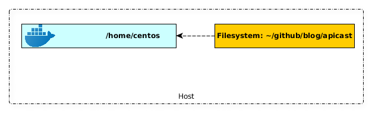

# Setting up the development environment

You need to configure an environment to work with Lua because APIcast policies are created in the Lua programming language. Additionally, you can use an actual APIcast server to perform local tests.

Following simple steps, you can set up a development environment for APIcast using Docker and Docker Compose.

### prerequisites
You must install Docker and Docker Compose:

   * Docker version 19.03.8. You can find instructions for installing Docker in the Docker [website](https://docs.docker.com/get-docker/).
   * Docker Compose version 1.25.4. You can find instructions for installing Docker Compose on the Docker [website](https://docs.docker.com/compose/install/).

Instructions for installing Docker Compose can also be found on the Docker [website](https://docs.docker.com/compose/install/).

### Setting up the development image
After you have installed Docker and Docker Compose, you can configure the APIcast development image.

. Clone the APIcast git repository. Use the stable branch of APIcast to base the policy on the latest 3scale release. 

```shell
git clone https://github.com/3scale/apicast.git
cd apicast/
```

. To start the APIcast containers using `docker-compose`,  use the *make* file provided by 3scale. Run this command in the APIcast directory:
```shell
make development
```

```bash
Running on Linux
docker-compose -f docker-compose-devel.yml -f docker-compose-devel-volmount-default.yml up -d
[+] Running 2/2
 ⠿ Container apicast_build_0-redis-1        Started                                                                                                                                                                                                                          0.8s
 ⠿ Container apicast_build_0-development-1  Started                                                                                                                                                                                                                          0.7s
docker-compose -f docker-compose-devel.yml -f docker-compose-devel-volmount-default.yml exec -e COLUMNS="`tput cols`" -e LINES="`tput lines`" --user 1000:1000 development bash
bash-4.4$
```
. The Docker container starts in the foreground with a bash session. The next step is to install all the dependencies inside the container, using a *make* command:

```shell
make dependencies
```

+
* The output will be very long. After a successful completion of the installation of all the dependencies, you will see a message similar to this:
+

```
Complete! Modules were installed into /opt/app-root/src/local
local/bin/carton bundle 2> /dev/null
Bundling modules using /opt/app-root/src/gateway/cpanfile
Complete! Modules were bundled into /opt/app-root/src/vendor/cache
bash-4.4$
```

Now you can run APIcast unit tests to see if everything is up and running and ready to start the development of our policy.

. To run the Lua unit tests, use the following command **inside** the container:

```shell
bash-4.4$ make busted
EXTRA_CFLAGS="-DHAVE_EVP_KDF_CTX=1" /usr/local/openresty/luajit/bin/rover install --roverfile=/opt/app-root/src/gateway/Roverfile > /dev/null
/usr/local/openresty/luajit/bin/rover exec bin/busted
●●●●●●●●●●●●●●●●●●●●●●●●●●●●●●●●●●●●●●●●●●●●●●●●●●●●●●●●●●●●●●●●●●●●●●●●●●●●●●●●●●●●●●●●●●●●●●●●●●●●●●●●●●●●●●●●●●●●●●●●●●●●●●●●●●●●●●●●●●●●●●●●●●●●●●●●●●●●●●●●●●●●●●●●●●●●●●●●●●●●●●●●●●●●●●●●●●●●●●●●●●●●●●●●●●●●●●●●●●●●●●●●●●●●●●●●●●●●●●●●●●●●●●●●●●●●●●●●◌●●●●●●●●●●●●●●●●●●●●●●●●●●●●●●●●●●●●●●●●●●●●●●●●●●●●●●●●●●●●●●●●●●●●●●●●●●●●●●●●●●◌●●●●●●●●●●●●●●●●●●●●●●●●●●●●●●●●●●●●●●●●●●●●●●●●●●●●●●●●●●●●●●●●●●●●●●●●●●●●●●●●●●●●●●●●●●●●●●●●●●●●●●●●●●●●●●●●●●●●●●●●●●●●●●●●●●●●●●●●●●●●●●●●●●●●●●●●●●●●●●●●●●●●●●●●●●●●●●●●●●●●●●●●●●●●●●●●●●●●●●●●●●●●●●●●●●●●●●●●●●●●●●●●●●●●●●●●●●●●●●●●●●●●●●●●●●●●●●●●●●●●●●●●●●●●●●●●●●●●●●●●●●●●●●●●●●●●●●●●●●●●●●●●●●●●●●●●●●●●●●●●●●●●●●●●●●●●●●●●●●●●●●●●●●●●●●●●●●●●●●●●●●●●●●●●●●●●●●●●●●●●●●●●●●●●●●●●●●●●●●●●●●●●●●●●●●●●●●●●●●●●●●●●●●●●●●●●●●●●●●●●●●●●●●●●●●●●●●●●●●●●●●●●●●●●●●●●●●●●●●●●●●●●●●●●●●●●●●●●●●●●●●●●●●●●●●●●●●●●●●●●●●●●●●●●●●●●●●●●●●●●●●●●●●●●●●●●●●●●●●●●●●●●●●●●●●●●●●●●●●●●●●●●●●●●●●●●●●●●●●●●●●●●●●●●●●●●●●●●●●●●●●●●●●●●●●●●●●●●●●●●●●●●●●●●●●●●●●●●●●●●●●●●●●●●●●●●●●●●●●●●●●●●●●●●●●●●●●●●●●●●●●●●●●●●●●●●●●●●●●●●●●●●●●●●●●●●●●●●●●●●●●●●●●●●●●●●●●●●●●●●●●●●●●●●●●●●●●●●●●●●●●●●●●●●●●●●●●●●●●●●●●●●●●●●●●●●●●●●●●●●●●●●●●●●●●●●●●●●●●●●●●●●●●●●●●●●●●●●●●●●●●●●●●●●●●
1208 successes / 0 failures / 0 errors / 2 pending : 6.209112 seconds

Pending → spec/policy/rate_limit/redis_shdict_spec.lua @ 33
Redis Shared Dictionary incr without default

Pending → spec/resty/http_ng_spec.lua @ 35
http_ng options method works with default options
```

After confirming that the unit tests run successfully, you can start the policy development.

The project’s source code will be available in the container, and synchronized with your local APIcast directory. You can edit files in your preferred environment and still run whatever you need inside the Docker container.

The development container for APIcast uses a Docker volume mount to mount the local APIcast directory inside the container. This means all files changed locally in the repository are synchronized with the container and used in the tests and runtime of the development container.



It also means you can use your favorite IDE or editor to develop your APIcast policy.

### Stopping the development container
Stopping the development environment container is a two step process. In the interactive Bash session, press:

```
Ctrl + C
```

This exits the foreground bash shell, but the containers are still running. Run the following make command to stop all containers:

```shell
$ make stop-development
docker-compose -f docker-compose-devel.yml -f docker-compose-devel-volmount-mac.yml down
Stopping apicast_build_0_development_1 ... done
Stopping apicast_build_0_redis_1       ... done
Removing apicast_build_0_development_1 ... done
Removing apicast_build_0_redis_1       ... done
Removing network apicast_build_0_default
```

Now you are ready to create a 3scale APIcast policy. The next step in the tutorial is [here](POLICY_SCAFFOLD.md)
