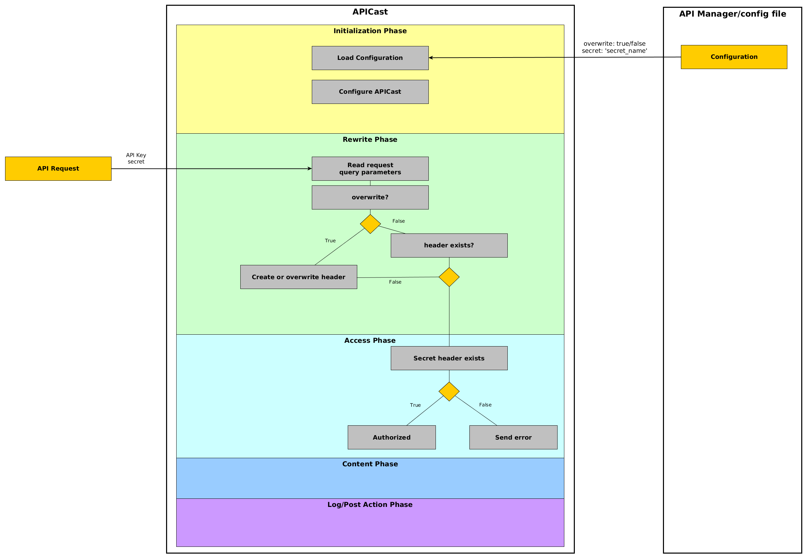

# Implementing the policy

In the last two parts of the APIcast policy development tutorial we looked at setting up the development environment and creating the scaffold of the policy. In this part we are actually going to implement and test the policy itself. Now in order to create a policy we need to have it implement some functionality. The policy must actually do something. Now the functionality of this policy is made purely for educational purposes. It is not going to win any killer feature prizes anytime soon. And as a matter of fact this single policy is going to perform two separate functions. Normally this would be split in two separate policies and chained together. But again, for educational purposes these two functionalities are going to be implemented in one policy. The main reason for this is that certain key concepts of policy development can be demonstrated. These concepts are:

* reading and using configuration properties
* reading query parameters from the HTTP request
* reading headers from the HTTP request
* creating headers in the request send to the upstream proxy
* executing a policy in multiple phases
* passing data between different phases of the policy

The policy we are going to create is going to transform all HTTP query parameters from the incoming request to HTTP headers send to the upstream response. With a configurable ‘overwrite’ flag we can during configuration indicate if a query parameter conflicts with an existing HTTP header if the HTTP header must be overwritten with the new value or if it should keep the existing HTTP header in place. In addition to this rewrite functionality we are going to provide another secret header in a configuration file. If the request does not contain this header with the value specified in the configuration the server will return a 403 forbidden response.
Schematically the functionality of the policy is outlined as follows:



Again, this is not going to win any killer feature prize soon, but it does illustrate the concepts outlined above.

## Policy configuration

### Creating the policy configuration schema

The policy scaffolding process generated a configuration schema which we need to extend to define the properties we can use in our policy.
In our case we need to add the following properties to the schema:
* overwrite of type boolean
* secret of type string
And while we are changing the schema, we might as well provide a neat summary and description of our policy.

The new configuration schema looks like this:
```json
{
  "$schema": "http://apicast.io/policy-v1/schema#manifest#",
  "name": "hello_world",
  "summary": "Parameter converter and secret checker",
  "description": [
      "Modifies HTTP query parameters in a request to HTTP headers. And checks the existence of the secret header."
  ],
  "version": "builtin",
  "configuration": {
    "type": "object",
    "properties": {
      "overwrite": {
        "description": "Overwrite flag used to indicate whether or not an existing header must be overwritten by this policy.",
        "type": "boolean"
      },
      "secret": {
        "description": "The additional static secret used for verifying the request.",
        "type": "string"
      }
    }
  }
}
```

### Reading the configuration properties in the policy
The parsing of the json properties to a Lua table is handled by the policy framework of APIcast itself. So we only need to worry about reading from the config object. To read the values of the config object simply reference them and place them in the self table. This self variable is accessible from everywhere in the policy and this these config variables can be used in subsequent functions.

```lua
function _M.new(config)
  local self = new(config)
  if config then
    if config.overwrite == nil then
      self.overwrite = true
    else
      self.overwrite = config.overwrite
    end
    self.secret = config.secret
  end
  return self
end
```

### Create unit tests
The scaffolding also created some unit tests, but since the policy was empty the unit tests did not do much. Now that the first code is written we can add another unit test.
Alter the accept configuration unit test to add the specific parameters:

```lua
it('accepts configuration', function()
    assert(_M.new({ overwrite = false, secret = "mysecret"}))
end)
```

## Implementing the rewrite
No we have the configuration properties available in our policy we can start implementing the rewrite of the query parameters to headers.
We are going to take a step by step approach to the creation of the policy.
* First we are going to define a function part of the policy module to execute in the rewrite phase which reads the HTTP query parameters and stores them in a Lua table.
* Then we create a local helper function to transform the HTTP query parameters to HTTP headers and provide the overwrite check
* lastly we are going to invoke the helper function from within the rewrite function

### Read request parameters
In order to create a function executing in the ‘rewrite’ phase of Nginx we need to create a function called ‘rewrite’ and store it in the policy module, which has a variable _M.
Even though this is not a beginners Lua tutorial it is worth noting the declaration of the function is done with a : (colon) instead of a . (dot), this is syntactic sugar in the Lua programming language and adds the self variable as a function argument without explicitly defining it. We need the self variable to access the configuration properties we defined above.

```lua
function _M:rewrite(context)
 --read HTTP query params as Lua table
 local query_params = ngx.req.get_uri_args()

end
```

### Create or overwrite HTTP headers
Now that we have the rewrite function in place and the query parameter stored in a variable we can create a separate function performing the transformation. Off course this could easily be implemented all inside the rewrite function but creating separate functions often is a bit neater. Also it gives an opportunity to introduce another kind of function. The local function, of which the code looks like this:

```lua
local function paramsToHeaders(query_params, overwrite)
 for k, v in pairs(query_params) do
  if overwrite == false and ngx.req.get_headers()[k] ~= nil then
   ngx.log(ngx.NOTICE, "existing header found with name " .. k .. " but not overwritten because of setting overwrite is " .. tostring(overwrite))
  else
   ngx.req.set_header(k, v)
  end
 end
 ngx.req.set_uri_args = nil
end
```

The difference between the rewrite and paramsToHeaders function declaration is that the latter has the local keyword and that the function is not part of the _M module. This essentially creates a ‘private’ function which can only be invoked from other functions inside the policy module.
Now that the functionality is in place we can invoke the new function from within the rewrite method:

```lua
function _M:rewrite(context)
 --read HTTP query params as Lua table
 local query_params = ngx.req.get_uri_args()
 paramsToHeaders(query_params, self.overwrite)

end
```

**Note: it is important to place the paramsToHeaders function above the rewrite function.**

### Create unit tests
Now that our policy has some body to it we need to verify our functionality is correct. We can do this by creating some additional unit tests.
But before writing the actual unit tests there is some additional setup required within the unit tests. Because the unit test framework ‘Busted’ used with APIcast does not perform the unit test in the actual Nginx worker process the Nginx specific function calls are not available. So ngx.req.get_uri_args() and ngx.req.set_header() are not able to execute within the unit test. In order to create proper functioning unit tests mock have to be created for these function calls.
The skeleton for the unit tests looks something like this:

```lua
describe('rewrite with overwrite', function()
  local config = { overwrite = true, secret = "mysecret" }
  local ngx_req_params = {}
  local ngx_req_headers = {}
  local context = {}

  before_each(function()

    stub(ngx.req,'get_headers', function()
      return ngx_req_headers
    end)

    stub(ngx.req, 'set_header', function(name, value)
      ngx_req_headers[name] = value
    end)

    stub(ngx.req, 'get_uri_args', function()
      return ngx_req_params
    end)

  end)

  –- unit tests come here

end)
```

In the first line the ‘describe’ we define a block for our unit tests. This is more a logical group of one or more unit tests executing with the same stubs and config variables which are defined below. In this example all unit tests with the override configuration parameter set to ‘true’ are executed in a single block. Off course this is just an example of grouping a set of unit tests based on a configuration parameter, the grouping of unit tests is an arbitrary decision left to the developer. But do keep in mind the before_each function is part of the group.
After and inside the describe we define four different local variables:
* config – this is the Lua table equivalent of the configuration parameters used in this policy. Since we are going to test the rewrite with overwrite the overwrite property is set to true.
* ngx_req_params – an empty Lua table which we are going to use in our mock/stub for storing the HTTP query parameters
* ngx_req_headers – again an empty Lua table which we are going to use in our mock/stub for storing the HTTP headers
* context – an empty Lua table for storing the context. We are going to take a closer look at the context later when we are going to extend the policy to read the secret header.

After the declaration of the variables the before_each function is defined, this function executes before each unittests and contains the stubs/mocks for the Nginx specific function calls. Essentially creating wrappers over our empty tables.
Now that the setup is in place we can implement a unit test.

```lua
describe('rewrite with overwrite', function()
  local config = { overwrite = true, secret = "mysecret" }
  local ngx_req_params = {}
  local ngx_req_headers = {}
  local context = {}

  before_each(function()

    stub(ngx.req,'get_headers', function()
      return ngx_req_headers
    end)

    stub(ngx.req, 'set_header', function(name, value)
      ngx_req_headers[name] = value
    end)

    stub(ngx.req, 'get_uri_args', function()
      return ngx_req_params
    end)

  end)

  it('test single param', function()
    local hello_world_policy = _M.new(config)
    --create the test request
    ngx_req_params["testkey"] = 'testvalue'
    --execute the policy function
    hello_world_policy:rewrite(context)
    --retrieve the http header and verify the content
    local responseheader = ngx.req.get_headers()["testkey"]
    assert.same("testvalue", responseheader)
  end)

  it('test overwrite header', function()
    local hello_world_policy = _M.new(config)
    --create the test request
    ngx_req_params["testkey"] = 'testvalue'
    ngx_req_headers["testkey"] = 'myheader'
    --execute the policy function
    hello_world_policy:rewrite(context)
    --retrieve the http header and verify the content
    local responseheader = ngx.req.get_headers()["testkey"]
    assert.same("testvalue", responseheader)
  end)

  it('test multiple params', function()
    local hello_world_policy = _M.new(config)
    --create test request
    ngx_req_params["param1"] = "value1"
    ngx_req_params["param2"] = "value2"
    --execute the policy function
    hello_world_policy:rewrite(context)
    --retrieve the http headers and verify the content
    local header1 = ngx.req.get_headers()["param1"]
    local header2 = ngx.req.get_headers()["param2"]
    assert.same("value1", header1)
    assert.same("value2", header2)
  end)
end)
```

Above three unittests are defined executing the policy and asserting the parameters have successfully been transformed to HTTP headers.
To execute the unit test inside the Docker developer image execute the following command:

```shell
make busted
```

## Extending the policy
Now that we have the rewrite of HTTP query parameters to HTTP headers in place let’s extend the policy to do some additional thing. It is again worth noting that normal policy design would be to scope a single policy to do only one particular thing and use the chaining of multiple policies to create higher levels of functionality. Adding other unrelated functionality breaks this principle, but for educational purposes there is one additional thing we can look at, and that is.
**Execute code in multiple Nginx phases and passing data between those Nginx phases.**

And in order to do that we are going to read the HTTP secret header in the ‘rewrite’ phase and pass it as a Lua variable to the ‘access’ phase in which we are going to compare it against the value set in the configuration of the policy.

Let’s start with implementing the ‘access’ phase of the policy:
```lua
function _M:access(context)

 local secret_header = context.secret_header

 if secret_header ~= self.secret then
  ngx.log(ngx.NOTICE, "request is not authorized, secrets do not match")
  ngx.status = 403
  return ngx.exit(ngx.status)
 else
  ngx.log(ngx.NOTICE, "request is authorized, secrets match")
 end

end
```

The first line within the access function declares a local variable and sets the value to the secret_header from the context variable. Which is passed as an argument to the access function.
Then a simple if/else is executed to evaluate the secret_header variable to the value in the config. When these do not match the status is set to 403 (forbidden) and the process exits with ngx.exit
Now that we have the ‘access’ function in place reading from the context let’s modify the ‘rewrite’ function we created earlier to write the secret_header to the context.

```lua
function _M:rewrite(context)

 --read HTTP query params as Lua table
 local query_params = ngx.req.get_uri_args()

 paramsToHeaders(query_params, self.overwrite)

 local secret_header = ngx.req.get_headers()["secret"]
 context.secret_header = secret_header

end
```

Above the modified rewrite function. The last two lines of the function read the ‘secret’ HTTP header and assigns the content to the variable secret_header. Which in the last line is written to the context (which is implemented using a Lua table).

### Create unit tests
Like the HTTP parameter to HTTP header rewrite this additional functionality needs to be verified. In order to do so some unit tests can be created.

```lua
describe('secret header test', function()

   local config = {secret = "mysecret" }
  local ngx_req_headers = {}
  local ngx_req_params = {}
  local context = {}

  before_each(function()

    stub(ngx.req,'get_headers', function()
      return ngx_req_headers
    end)

    stub(ngx.req, 'set_header', function(name, value)
      ngx_req_headers[name] = value
    end)

    stub(ngx.req, 'get_uri_args', function()
      return ngx_req_params
    end)

  end)

  it('authorized', function()
    local hello_world_policy = _M.new(config)

    ngx_req_headers["secret"] = "mysecret"

    hello_world_policy:rewrite(context)
    hello_world_policy:access(context)

  end)
  it('not authorized', function()
    local hello_world_policy = _M.new(config)

    ngx_req_headers["secret"] = "myownsecret"

    hello_world_policy:rewrite(context)
    hello_world_policy:access(context)

    assert.same(ngx.status, 403)
  end)
end)
```

Since the writing to the context is performed in the ‘rewrite’ phase that phase needs to be executed as well. So the same stubs are required in this unit test as the ones we saw earlier. In the tests itself both the rewrite and access functions are called with the context variable as argument. This context variable is an empty Lua table. The first, and only, value in this table is written to in inside the rewrite phase of the policy. In the last unit test the returning status code is verified to be 403.
Again, like earlier the unit tests can be executed inside the development container using the command:

```shell
make busted
```
Now that we have implemented our policy and performed some unit tests we can try and run the policy locally to verify it will run properly. This is described [here](POLICY_RUN_LOCALLY.md)