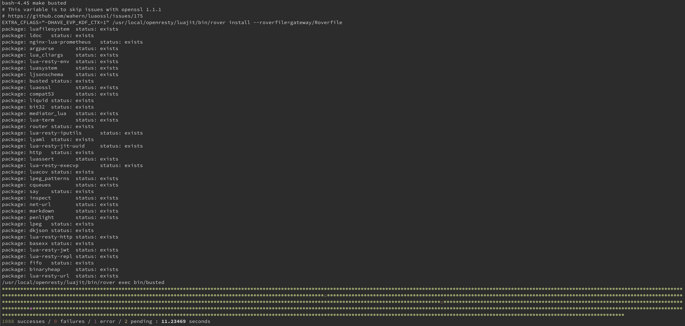

# Generate a policy scaffold
In first part of the tutorial about APIcast policy development we looked into the setup of a development environment. Now we have a functioning development environment we can start the actual development of the APIcast policy. In this part we will take a look and use the scaffolding utility provided by APIcast to generate a policy scaffold.

The first thing we are going to do is create a new git branch of the APIcast source we have cloned in the previous part. This is an optional step, but developing a new feature or changing code in general in a new branch is a good habit to get into. So create a new branch and start up our development container.

```shell
$ git checkout -b policy-development-tutorial
Switched to a new branch 'policy-development-tutorial'
$ make development
```

To generate the scaffold of our policy we can use the apicast utility located in the bin/ directory of our development container.
So in the development container issue the following command:

```shell
$ bin/apicast generate policy hello_world
```

where hello_world is the name of the policy.

```shell
bash-4.4$ bin/apicast generate policy hello_world
source: /home/centos/examples/scaffold/policy
destination: /home/centos

exists: spec
exists: spec/policy
created: spec/policy/hello_world
created: spec/policy/hello_world/hello_world_spec.lua
exists: t
created: t/apicast-policy-hello_world.t
exists: gateway
exists: gateway/src
exists: gateway/src/apicast
exists: gateway/src/apicast/policy
created: gateway/src/apicast/policy/hello_world
created: gateway/src/apicast/policy/hello_world/apicast-policy.json
created: gateway/src/apicast/policy/hello_world/init.lua
created: gateway/src/apicast/policy/hello_world/hello_world.lua
```

As you can see from the output of the generate policy command a few files have been created. These artifacts related to our policy are located in three different directories:

* t/ – this directory contains all Nginx integration tests
* src/gateway/apicast/policy – this directory contains the source code and configuration schemas of all policies. Our policy resides in the subdirectory of hello_world
* spec/policy – this directory contains the unit tests of all policies. The unit tests for our policy resides in the subdirectory of hello_world

So the policy scaffolding utility not only generates a scaffold for our policy, but also the files for a configuration schema, unit tests and integration tests. Let’s have a look at these files.

The source code of our policy residing in the directory src/gateway/apicast/policy/hello_world contains three files.

* init.lua - all policies contain this init.lua file. It contains 1 line importing (require in Lua) our policy. It should not be modified.
* aplicast-policy.json - The APIcast gateway is configured using a json document. Policies requiring configuration also use this json document. The apicast-policy.json file is a json schema file were configuration properties for the policy can be defined. We will look into configuration properties and this file in more detail in our next part of the workshop.
```json
{
  "$schema": "http://apicast.io/policy-v1/schema#manifest#",
  "name": "hello_world",
  "summary": "TODO: write policy summary",
  "description": [
      "TODO: Write policy description"
  ],
  "version": "builtin",
  "configuration": {
    "type": "object",
    "properties": { }
  }
}
```
* hello_world.lua - This is the actual source code of our policy, which at the moment does not contain much.
```lua
-- This is a hello_world description.
local policy = require('apicast.policy')
local _M = policy.new('hello_world')
local new = _M.new
--- Initialize a hello_world
-- @tparam[opt] table config Policy configuration.
function _M.new(config)
  local self = new(config)
  return self
end
return _M
```

The first two lines import the APIcast policy module an instantiate a new policy with hello_world as an argument. This returns a module itself which is implemented using a Lua table. Lua is not an Object Oriented language from itself but tables (and especially metatables) can mimic objects. The third line stores a reference to a function new which is defined below. The new function takes a config variable as argument, but as of now nothing is done with is. The new method simply returns itself. Finally the module representing our policy is returned. This is done so other components importing this policy module retrieve the table and can invoke all functions and variables stored in the policy.
We won’t cover all the files in details here since we are going to touch these in upcoming series when we flesh out our policy with functionality.
But as a final verification to see if we have something working let’s run the unit tests again.



The keen observer can see the number of successes in the unit test outcome has increased by 2 after we generated the scaffold for our policy.

In the next part we actually create the implementation of the policy. This is described [here](POLICY_IMPLEMENTATION.md)