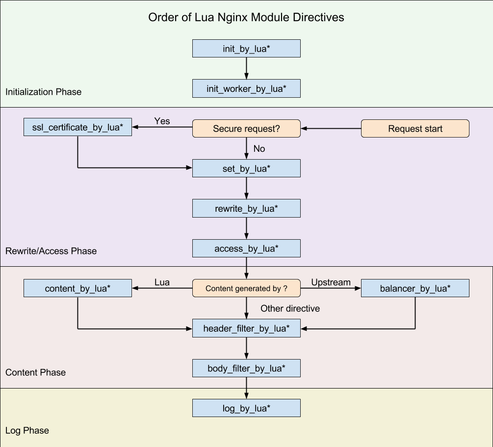

# APIcast policy development tutorial
This repository contains the code and configuration of an APIcast policy used in the tutorial described in this README.
Its purposes are to provide a first introduction to the world of policy development.

In this tutorial you will dive into the development and testing of a custom APIcast policy. In the first part you will setup a development environment so you can start the development of the policy.

Before beginning, first take a look what an APIcast policy is, described [here](../policies.md).

The APIcast gateway is based on [NGINX](https://www.nginx.com/) and more specifically [OpenResty](http://openresty.org/en/), which is a distribution of NGINX compiled with various modules, most notable the [lua-nginx-module](https://github.com/openresty/lua-nginx-module).

The lua-nginx-module provides the ability to enhance a NGINX server by executing scripts using the [Lua programming language](https://www.lua.org/). This is done by providing a Lua hook for each of the NGINX phases. NGINX works using an event loop and a state model where every request, as well as the starting of the server and its worker processes, goes through various phases. Each phase can execute a specific Lua function.

An overview of the various phases and corresponding Lua hooks was in the README of the lua-nginx-module: https://github.com/openresty/lua-nginx-module#directives

Since the APIcast gateway uses OpenResty, a way to leverage these Lua hooks in the NGINX server is provided by something called policies. As described in the APIcast README:

**“The behaviour of APIcast is customizable via policies. A policy basically tells APIcast what it should do in each of the NGINX phases.”**

The code in this repo follows the APIcast directory structure.
To use this code it must be integrated in the APIcast code.
Therefore the code and configuration in this repository act for reference purposes only.

The tutorial was 4 distinct sections:
1. [setup the development environment](DEV_ENV_SETUP.md)
2. [generate a policy scaffold](POLICY_SCAFFOLD.md)
3. [create and test the policy](POLICY_IMPLEMENTATION.md)
4. [run the policy locally](POLICY_RUN_LOCALLY.md)